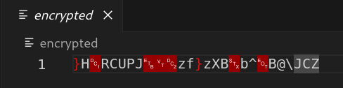

# Practice

[Code listing](Code%20listing%20e3fa441b7a3f454baf9e4cd586a83f88.md)

## Введение

Реверс-инжиниринг клиент-серверного приложения и эксплуатация найденных уязвимостей 

Декомпозиция работы приложения client (ELF64)

Данное приложение представляет собой клиент игры, которая общается с неким сервером на порту 4444. Вместе с бинарным файлом мною также был получен дамп трафика содержащий в себе общение клиента и сервера.

На основе чего мною была написана реализация сервера следующего вида:

```python
import socket
import json
import uuid

def handle_client(client_socket, addr):
    # Получаем сообщение от клиента
    request = client_socket.recv(1024).decode('utf-8')
    print(f"Received: {request}")
    if (len(request) == 0):
        client_socket.close()
        return
    data = json.loads(request)
    
    if data.get("action") == "autojoin":
        room_id = "297153fe-a7de-4de6-84b4-b61022830e25"
        response = {"success": "True", "message": room_id}
        client_socket.send(json.dumps(response).encode('utf-8') + b'\x0a')
        print(f"Sent: {response}")

    if data.get("action") == "register":
        identifier = "92878f1b-87bf-4926-ada0-bccec293f8ac"
        response = {"success": "True", "message": identifier}
        client_socket.send(json.dumps(response).encode('utf-8') + b'\x0a')
        print(f"Sent: {response}")
    
    if data.get("action") == "debuggame":
        room_id = str(uuid.uuid4())
        response = {"success": "True", "message": room_id}
        client_socket.send(json.dumps(response).encode('utf-8') + b'\x0a')
        print(f"Sent: {response}")
 
    if data.get("action") == "isready":
        response = {"success": "True", "message": "True"}
        client_socket.send(json.dumps(response).encode('utf-8') + b'\x0a')
        print(f"Sent: {response}")

    if data.get("action") == "getseed":
        response = {"success": "True", "message": "4369316"}
        client_socket.send(json.dumps(response).encode('utf-8') + b'\x0a')
        print(f"Sent: {response}")

    if data.get("action") == "sendans":
        response = {"success": "False", "message": data.get("room_id")}
        client_socket.send(json.dumps(response).encode('utf-8') + b'\x0a')
        print(f"Sent: {response}")

    if data.get("action") == "isended":
        response = {"success": "True", "message": "True"}
        client_socket.send(json.dumps(response).encode('utf-8') + b'\x0a')
        print(f"Sent: {response}")

    if data.get("action") == "getflag":
        response = {"success": "False", "message": data.get("room_id")}
        client_socket.send(json.dumps(response).encode('utf-8') + b'\x0a')
        print(f"Sent: {response}")
    client_socket.close()
    print(f"Closed connection: {addr}")

def main():
    server = socket.socket(socket.AF_INET, socket.SOCK_STREAM)
    server.bind(("0.0.0.0", 4444))
    server.listen(5)
    print("Server listening on port 4444")

    while True:
        client_socket, addr = server.accept()
        print(f"Accepted connection from {addr}")
        handle_client(client_socket, addr)

if __name__ == "__main__":
    main()
  
```

Взаимодействие будет иметь следующий вид. При каждом сообщение клиентское приложение поднимает новое подключение.

1-2. Клиент проверяет доступность сервера

1. Клиент запрашивает регистрацию, в ответ сервер высылает True и message с identifier клиента
2. Клиент запрашивает подключение к “комнате”, сервер в ответ высылает True и message с room_id
3. Клиент запрашивает, готовность сервера
4. Клиент запрашивает seed (в дальнейшем этот seed используется для настройки рандома клиента и генерации карты)
5. Под конец игры клиент высылает пакет sendans, содержащий в себе payload (маршрут который игрок прошел). Данный маршрут будет использоваться при расшифровке описанной ниже

```python
#1
Accepted connection from ('127.0.0.1', 41794)
Received: 

#2
Accepted connection from ('127.0.0.1', 41806)
Received: 

#3
Accepted connection from ('127.0.0.1', 41810)
Received: {"action":"register","payload":"1235"}
Sent: {'success': 'True', 'message': '92878f1b-87bf-4926-ada0-bccec293f8ac'}
Closed connection: ('127.0.0.1', 41810)

#4
Accepted connection from ('127.0.0.1', 41826)
Received: {"action":"autojoin","identifier":"92878f1b-87bf-4926-ada0-bccec293f8ac"}
Sent: {'success': 'True', 'message': '297153fe-a7de-4de6-84b4-b61022830e25'}
Closed connection: ('127.0.0.1', 41826)

#5
Accepted connection from ('127.0.0.1', 41840)
Received: {"action":"isready","identifier":"92878f1b-87bf-4926-ada0-bccec293f8ac","room_id":"297153fe-a7de-4de6-84b4-b61022830e25"}
Sent: {'success': 'True', 'message': 'True'}
Closed connection: ('127.0.0.1', 41840)

#6
Accepted connection from ('127.0.0.1', 41856)
Received: {"action":"getseed","identifier":"92878f1b-87bf-4926-ada0-bccec293f8ac","room_id":"297153fe-a7de-4de6-84b4-b61022830e25"}
Sent: {'success': 'True', 'message': '4369316'}
Closed connection: ('127.0.0.1', 41856)

#7
Accepted connection from ('127.0.0.1', 52182)
Received: {"action":"sendans","identifier":"92878f1b-87bf-4926-ada0-bccec293f8ac","payload":"[0,11016]","room_id":"297153fe-a7de-4de6-84b4-b61022830e25"}
Sent: {'success': 'False', 'message': '297153fe-a7de-4de6-84b4-b61022830e25'}
```

Конечным результатом игры будет последовательность номеров пройденных городов. Эта последовательность необходима для расшифровки приложенной к заданию криптограммы и скрипта который расшифрует её:



**Приложенная криптограмма**

```python
#Скрипт для расшифровки криптограммы
from sys import argv
from hashlib import sha256 as h

def decrypt(key:bytes, encrypted:bytes):
    answer = ""
    if h(key).hexdigest() != 'c1dcd4efdf350a9f2e3da2bde829f3cb39a9f9a1a98a495b9d6e1e80a0ef1269':
        return "Invalid key"
    for i in range(len(key)):
        answer += chr(key[i] ^ encrypted[i])
    return answer

if __name__ == "__main__":
    if len(argv) != 3:
        print("Usage: ./decrypt.py <key> encrypted_creds")
        print("Example: if answer for server is [0,1,2,3,4] then key is 01234")
        exit(0)
    f = open(argv[2], 'rb')
    encrypted = f.read()
    f.close()
    print(decrypt(argv[1].encode(), encrypted))
```

Запустим игру и проанализируем её поведение. Первые два экрана представляют собой главное меню (рис. 1) и экран загрузки (рис. 2).


**Рисунок 1 - Главное меню игры**


Рисунок 2 - Экран загрузки после нажатия Play

Следующие два экрана представляют собой уже основную часть игры. Вся суть заключается в поиске маршрута до определенного города. (Анализ бинарного файла позволил сделать вывод что конечной точкой маршрута будет город “Uganda”).


Рисунок 3 - Экран с выбором городов

## Инструментированный анализ приложения


Рисунок 4 - Экран окончания игры

Перейдем к разбору самого бинарного файла. Для анализа были использованы следующие инструменты:

- Дизассемблер и декомпилятор IDA Free 8.4
- Дебаггер EDB
- Дебаггер Delve (Дебаггер под программы написанные на Go)
- Python библиотека pwntools.

Данная программа написана на языке Golang, из-за чего листинг кода декомпилятора будет наполнен странными конструкциями (Например Garbagecollector). 

### Анализ функции main_main

Рассмотрим основную часть функции `main_main`- входной точки программы.

[**Листинг main_main**](Code%20listing%20e3fa441b7a3f454baf9e4cd586a83f88.md)

В данном блоке проверяется аргумент командной строки - адрес сервера к которому подключается клиент. Если аргумента нету, то программа завершает выполнение.

Если адрес введён, то далее управление переходит к функции `github_com_hajimehoshi_ebiten_v2_RunGame` Данная функция является стартовой точкой игрового движка, который автор использовал для данной игры.

Адрес сервера будет хранится в глобальной переменной `main__addr` типа `string`по адресу `0xC8E0C0`

Стоит упомянуть, что в языке структура строки имеет следующий вид:

```c
00000000 struct string // sizeof=0x10
00000000 {                                       
00000000                                         
00000000     uint8 *str;                         
00000000                                         
00000008     int len;                            
00000008                                         
00000010 };
```

В отличие от C-подобных строк, строки в Golang не имеют нуллбайта на своем окончании. Программа вычисляет конец строки по её длине. Это создает некоторые сложности при работе с глобально-хранящимися строками. Декомпилятор будет воспринимать эту последовательность как одну длинную строку.


Пример представления Golang строки. Декомпилятор IDA                                                                                                      

### Основные состояния игры

Основной цикл игры реализован в функциях `main.(*Game).Draw`, которая отрисовывает основные экраны игры и `main.(*Game).Update` , которая обрабатывает основную логику.

[**Листинг main.(*Game).Draw**](Code%20listing%20e3fa441b7a3f454baf9e4cd586a83f88.md)

[**Листинг main.(*Game).Update**](Code%20listing%20e3fa441b7a3f454baf9e4cd586a83f88.md)

Исходя из декомпилированного кода, делаем вывод что игра имеет 4 состояния, хранящихся в глобальной переменной `main__state` по адресу `0xCE03E8` В зависимости от значения данной переменной, движок отрисовывает следующие экраны:

| main__state | 0 | 1 | 2 | 3 |
| --- | --- | --- | --- | --- |
| Статус игры | Main_menu | Connecting | Pathfind | End |
| Описание экрана | Главное меню | Экран загрузки | Основной экран игры | Экран окончания игры |
| Вызываемый экран | main__ptr_Game_D_Main_menu | Отрисовывается внутри самой функции [main.(*Game).Draw](Code%20listing%20e3fa441b7a3f454baf9e4cd586a83f88.md) | main__ptr_Game_D_Pathfind | main__ptr_Game_D_END |
| Функция обрабатывающая логику | [main__ptr_Game_U_Main_menu](Code%20listing%20e3fa441b7a3f454baf9e4cd586a83f88.md) | main__ptr_Game_U_Connecting | main__ptr_Game_U_Pathfind | main__ptr_Game_U_END |

Описанные экраны ранее были представлены на рисунках 1-4. 

Перейдем к перейдем к разбору логики каждого экрана:

### main__ptr_Game_U_Main_menu

[Листинг main.(*Game).U_Main_menu](Code%20listing%20e3fa441b7a3f454baf9e4cd586a83f88.md)

Проверяется подключение к серверу, если оно отсутствует, то инициализируется функцией `test_client__ptr_Con_Init(&main__con, serveraddres);` в качестве аргументов которой передается ссылка на глобальную переменную `main__conn`, хранящую подключение и строку содержащую адрес сервера (в нашем случае 127.0.0.1:4444).

Глобальная переменная `main__conn` является структурой следующего вида:

```c
00000000 struct test_client_Con // sizeof=0x68
00000000 {                                       
00000000     string _addrudp;
00000010     string _addr;
00000020     string _ind;
00000030     string _rid;
00000040     net_Conn con;
00000050     time_Time LastQ;
00000068 };
```

В случае успешного подключения, глобальной переменной устанавливается следующее значение `main_connectionState = 1` , а также `main__state = 1` , что означает переключение статуса игры в **Connecting**. Если подключение оказалось неудачным, вызывается `log_Fatal` и программа завершает свою работу.

### main__ptr_Game_U_Connecting

[**Листинг main.(*Game).U_Connecting**](Code%20listing%20e3fa441b7a3f454baf9e4cd586a83f88.md)

Данная функция отвечает за основной обмен сообщений при подключением клиента к серверу, а также вызову функции `test_game__ptr_Pathfind_Init`  инициализирующей данные для экрана с основной игрой. Примерный функционал укладывается в следующий код:

```c
test_client__ptr_Con_Register(&main__con); // [Регистрация пользователя](Practice%2081cf63bd85314211bba99d196e278d54.md)
test_client__ptr_Con_JoinRoom(&main__con); // [Подкчлюение к комнате](Practice%2081cf63bd85314211bba99d196e278d54.md)
if ( (unsigned __int8)test_client__ptr_Con_ReciveStart(&main__con) ) // [Получение команды старт от сервера](Practice%2081cf63bd85314211bba99d196e278d54.md)
{
	Seed = test_client__ptr_Con_GetSeed(&main__con); // [Получения значениея Seed, необходимого для генерации карты, в нашем случае 4369316](Practice%2081cf63bd85314211bba99d196e278d54.md)
	test_game__ptr_Pathfind_Init(
	&main__gme, // Адрес глобальной переменной со статус игры, структура описана ниже
	(test_game_Graph *)15000, // Размер карты
	Seed, // Seed используемый в случайной генерации карты
	(map_int_map_int_int *)10, 
	test_images_Cities_txt // Строка с большим количеством названий городов разделенных нуллбайтами длиной 0xC8617 символов
	);
	
	main__state = 2LL;
}
```

За статус самой игры по поиску пути отвечает глобальная переменная `main__state` , она является структурой имеющей следующий вид:

```c
00000000 struct test_game_Pathfind // sizeof=0x70
00000000 {                                       
00000000     string PrString;   // Строка выводимая в конце игры                 
00000000                                         
00000010     bool Is_ended;     // Закончилась ли игра                 
00000010                                         
00000011     // padding byte
00000012     // padding byte
00000013     // padding byte
00000014     // padding byte
00000015     // padding byte
00000016     // padding byte
00000017     // padding byte
00000018     int size;         // Размер карты                   
00000020     int playerpos;    // Текущее местоположение игрока                 
00000020                                         
00000028     _slice_int path;  // Массив Int, содержащий в себе маршрут игрока                  
00000028                                         
00000040     test_game_Graph graph;  // Основной граф карты           
00000040                                         
00000070 };
```

Массивы в языке Go имеют следующий вид (на примере массива Int-ов):

```c
00000000 struct _slice_int // sizeof=0x18
00000000 {                                       
00000000                                         
00000000     int *array;                         // Ссылка на сам массив значений
00000000                                         
00000008     int len;                            // Текущее количество элементов
00000008                                         
00000010     int cap;                            // Максимальное количество элементов, после превышения лимита
00000010                                         // создается новый оьъект с большей вместимостью
00000018 };
```

### test_game__ptr_Pathfind_Init

[**Листинг test/game.(*Pathfind).Init**](Code%20listing%20e3fa441b7a3f454baf9e4cd586a83f88.md)

Данная функция инициализирует начальные данные переменной `main__state` , а именно:

```c
main_game->size = (int)graph_size; // 15000
main_game->playerpos = 0LL; 
main_game->PrString.len = 0LL; // Зануляется длина выводимой в конце игры строки
main_game->PrString.str = 0LL; // Зануляется выводимая в конце игры строка
  
test_game__ptr_Graph_Init( // Вызов функции инициализирующей граф катры
	&main_game->graph, // Передается ссылка на граф
	(int)graph_size, // Передается размер карты (15000)
	seed, 
	number, 
	name_cities // Названия городов
);
```

### test_game__ptr_Graph_Init

[**Листинг test/game.(*Graph).Init**](Code%20listing%20e3fa441b7a3f454baf9e4cd586a83f88.md)

Для начала рассмотрим саму структуру графа 

```c
00000000 struct test_game_Graph // sizeof=0x30
00000000 {                                       
00000000     test_game_SpecMatrix matrix;        // Матрица карты
00000000                                         
00000018     _slice_string names;                // Массив строк с названиями городов длиной 15000
00000018                                         
00000030 };
```

Структура матрицы имеет следующий вид:

```c
00000000 struct test_game_SpecMatrix // sizeof=0x18
00000000 {                                       
00000000     int sizex;
00000008     int sizey;
00000010     map_int_map_int_int map;            // HashMap типа <int,map<int,int>>
00000010                                         
00000018 };
```

Данная хэш-таблица будет иметь примерно следующий вид:


Рассмотрим процесс инициализации графа.

```c
graph->matrix.sizex = graph_size;
graph->matrix.sizey = graph_size;

i = 0;
while ( graph_size > i)
  {
    key = i;
    p_runtime_hmap = runtime_makemap_small();
    v11 = (map_int_map_int_int *)runtime_mapassign_fast64(
                                   (runtime_maptype *)&RTYPE_map_int_map_int_int_0,
                                   (runtime_hmap *)graph->matrix.map,
                                   key);
      matrix_map_int_map_int_int = v11;
    }
    i = key + 1;
  }
  
names = test_game_get_names(
          names_cities, // Ссылка на строковый объект с названиями городов
          (__int64)graph, // Ссылка на структуру test_game_Graph 
          (__int64)matrix_map_int_map_int_int, // Ссылка на HashMap
          (__int64)names_cities.str, // Ссылка на строку с названиями городов
          names_cities.len, // Длина строки с названиями городов
          v6,
          v7);
          
graph->names.len = names_cities_len; // 15000
graph->names.cap = capacity; 
graph->names.array = names;

math_rand__ptr_Rand_Seed(math_rand_globalRand, seed);

// Далее идет заполнение HashMap, с использованием math_rand_Int()
...

test_game__ptr_Graph_Optimize(graph); // В самом конце граф оптимизируется
```

Вкратце рассмотрим функцию `test_game_get_names` , так как использование значения seed идет уже после вызова данной функции, можно сделать вывод, что при каждом запуске, берутся абсолютно случайные названия городов. Однако стоит отметить, что в самом конце функции, на адрес массива строк 14999 устанавливается город **Uganda**, являющийся конечной точкой для выигрыша.

[**Листинг test/game.get_names**](Code%20listing%20e3fa441b7a3f454baf9e4cd586a83f88.md)

Так как нам известен Seed, используемый для генерации карты, а также он является постоянным, мы можем сделать вывод, что сам граф всегда будет иметь одинаковое построение (исключением являются названия промежуточных городов).

### main__ptr_Game_U_Pathfind

//todo

## Поиск подходящего пути

Итоговым решением стало написание скрипта, который считывает из памяти процесса все необходимые данные для поиска пути. Для упрощения задачи использовался Python фреймворк Pwntools. 

Для корректной работы, запускать в следующем порядке:

1. Запустить server.py
2. Запустить скрипт (вместе с ним запустится и игра)
3. В игре нажать кнопку play **(!!! Важно заметить, что если нажимать кнопку по центру, то вы также нажмете на один из городов в игре 
и перейдете на неверный маршрут, поэтому нажимать нужно на верхний правый край кнопки !!!)** 


1. Нажать любую кнопку в терминале, где запущен скрипт, для инициализации считывания данных из памяти и поиска пути. (Может занять пару минут, так как используется рекурсивный поиск)

```python

from pwn import *
from dataclasses import dataclass, field
from typing import List

exe = context.binary = ELF(args.EXE or './client')

def start(argv=["127.0.0.1"], *a, **kw):
    '''Start the exploit against the target.'''
    if args.GDB:
        return gdb.debug([exe.path] + argv, gdbscript=gdbscript, *a, **kw)
    else:
        return process([exe.path] + argv, *a, **kw, aslr=False)

# Specify your GDB script here for debugging
# GDB will be launched if the exploit is run via e.g.
# ./exploit.py GDB
gdbscript = '''
tbreak main
continue
'''.format(**locals())

io = start()

def read_int8(address):
    data = io.readmem(address, 8)
    return u64(data)
def read_int4(address):
    data = io.readmem(address, 4)
    return u32(data)
def read_int2(address):
    data = io.readmem(address, 2)
    return u16(data)
def read_int1(address):
    data = io.readmem(address, 1)
    return u8(data)

def read_str(address, length):
    data = io.readmem(address, length)
    return data

def init_string(addr):
    str_len = read_int8(addr + 8)
    p_str_addr = read_int8(addr)
    string = read_str(p_str_addr, str_len)
    return str(string)

def init_bucket_string_int(p_bucket: int, B_1:int):
    if (p_bucket == 0):
        return None
    bucket = {}
    for i in range(0, 2**B_1):
        bucket_addr = p_bucket + 0xD0 * i
        for j in range(8):
            bucket[init_string(bucket_addr + 8 + j*8*2)] = read_int8(bucket_addr + 0x88 + j * 8)
    return bucket
 
def init_map_string_int(p_map: int):
    if (p_map == 0):
        return None
    p_map = read_int8(p_map)
    if (p_map == 0):
        return None
    count_8 = read_int8(p_map)
    B_1 = read_int1(p_map+8+1)
    p_buckets = read_int8(p_map + 8 + 8)
    buckets = init_bucket_string_int(p_buckets, B_1)
    obj_addr = p_map
    return buckets

@dataclass
class StringSlice:
    p_str_arr: int = 0
    str_arr = {}
    length: int = 0
    cap: int = 0
    obj_addr: int = 0xC8F798
    def __str__(self):
        return "StringSlice(p_str_arr="+str(hex(self.p_str_arr))+", length="+str(self.length)+", capacity="+str(self.cap)+ ", obj_addr="+str(hex(self.obj_addr))+")"

def init_stringslice():
    initstringslice = StringSlice(p_str_arr=read_int8(0xC8F798), length=read_int8(0xC8F7A0), cap = read_int8(0xC8F7A8))
    for i in range(initstringslice.length):
        obj_addr = initstringslice.p_str_arr + i*16
        initstringslice.str_arr[i] = init_string(obj_addr)
    return initstringslice

def init_bucket_int_int(p_bucket: int, B_1: int):
    if (p_bucket == 0):
        return None
    bucket = {}
    for i in range(0, 2**B_1):
        bucket_addr = p_bucket + 0x90 * i
        for j in range(8):
            index = read_int8(bucket_addr + 8 + j * 8)
            state = read_int8(bucket_addr + 8 + 64 + j * 8)
            if state != 18446744073709551615 and index != 0:
                bucket[index] = state
    return bucket
 
def init_map_int_int(p_map: int):
    if (p_map == 0):
        return None
    count_8 = read_int8(p_map)
    B_1 = read_int1(p_map+8+1)
    p_buckets = read_int8(p_map + 8 + 8)
    obj_addr = p_map
    buckets = init_bucket_int_int(p_buckets, B_1)
    return buckets

def init_bucket_int_map_int_int(p_bucket: int, B_1: int):
    if (p_bucket == 0):
        return None
    bucket = {}
    for i in range(0, 2**B_1):
        bucket_addr = p_bucket + 0x90 * i
        for j in range(8):
            #map_int_int = init_map_int_int(bucket_addr + 8 + 64 + j * 8)
            index = read_int8(bucket_addr + 8 + j*8)
            bucket[read_int8(bucket_addr + 8 + j*8)] = bucket_addr + 8 + 64 + j * 8 #map_int_int
    return bucket

@dataclass
class Map_int_map_int_int:
    count_8: int
    B_1: int
    p_buckets: int
    buckets: {}
    obj_addr: int

def init_map_int_map_int_int(p_map: int):
    count_8 = read_int8(p_map)
    B_1 = read_int1(p_map+8+1)
    p_buckets = read_int8(p_map + 0x10)
    obj_addr = p_map
    buckets = init_bucket_int_map_int_int(p_buckets, B_1)
    #return buckets
    return Map_int_map_int_int(count_8, B_1, p_buckets, buckets, obj_addr)

def pathfind(city: int, cities_map: Map_int_map_int_int, path=None, depth=0, total_length=0, all_paths=None):
    if path is None:
        path = [city]
        total_length = len(str(city))
    else:
        path = path + [city]
        total_length += len(str(city))
    if all_paths is None:
        all_paths = []
    # Проверка на достижение цели
    if city == 14999 and total_length == 26:
        all_paths.append(path)
        return all_paths
    # Ограничение глубины рекурсии
    if depth > 5 or total_length > 26:
        return all_paths
    # Проверка наличия города в карте
    if city not in cities_map.buckets:
        return all_paths
    # Получение адреса города и его соединений
    city_addr = read_int8(cities_map.buckets[city])
    connections = init_map_int_int(city_addr)
    # Проверка на наличие соединений
    if connections is None:
        return all_paths
    # Рекурсивный поиск пути через все соединения
    for next_city in connections.keys():
        if next_city not in path:  # чтобы избежать циклов
            all_paths = pathfind(next_city, cities_map, path, depth + 1, total_length, all_paths)

    return all_paths

main__moves_addr = 0xC8D360

io.recvuntil(b'Connected')
pause()

info("Initializing moves...")
moves = init_map_string_int(main__moves_addr)
info("Initializing strings...")
strings = init_stringslice()
info("Initializing map...")
maptest = init_map_int_map_int_int(read_int8(0xC8F780+8*2))

info("Initializing pathfinding...")

paths = []
# 
# for k, v in moves.items():
#     paths.append(pathfind(v, maptest))
#     print(paths)

paths.append(pathfind(111, maptest))
print(paths)

for path in paths:
    str_path = ""
    for city in path:
        str_path += f' {strings.str_arr[city]}'
    print(str_path)

pause()
io.interactive()
```

Результаты выполнения:


Попробуем расшифровать криптограмму


